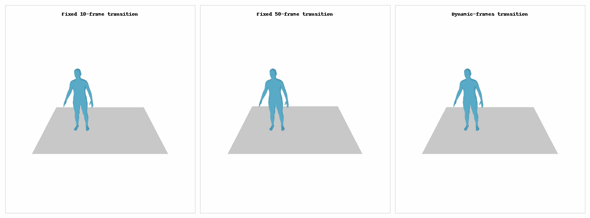
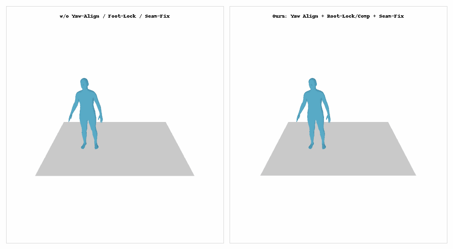

# Motion Transition – Comparative Demos

## Transition Length Matters

*Transition length ablation (Fixed-10, Fixed-50, Dynamic).
Fixed-10 fails to smooth large pose gaps (visible jitter at the seam);
Fixed-50 reduces the seam distance but induces style dilution and semantic drag;
Dynamic SLERP assigns frames based on start–end pose similarity, striking a better balance between smoothness and fidelity.*

## Effect of Yaw Alignment & Foot Constraints

*Impact of yaw alignment and foot constraints.
w/o Yaw-Align / Foot-Lock /  Seam-Fix yields turning drift and foot sliding at the boundary;
Ours (Yaw-Align + Foot-Lock + Seam-Fix) ensures positional/orientational continuity and stabilizes the support foot.*
